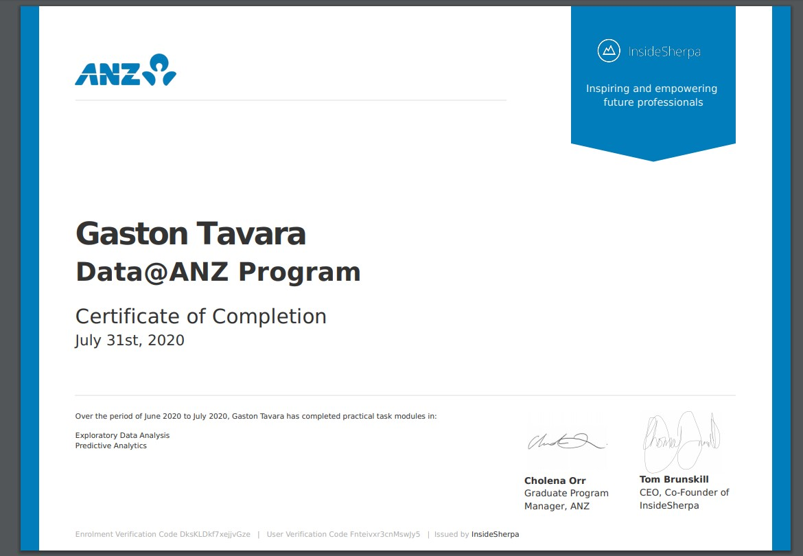

How the virtual experience program works:

1 View the module to find out what you have to do. Each module includes links to resources to help you complete the task.

2 Submit your work and review the model answers to see how well you’ve done.

3 Once you have completed all tasks, you can put this virtual experience program on your resume.

https://insidesherpa.s3.amazonaws.com/completion-certificates/ANZ/ZLJCsrpkHo9pZBJNY_ANZ_Fnteivxr3cnMswJy5_completion_certificate.pdf
